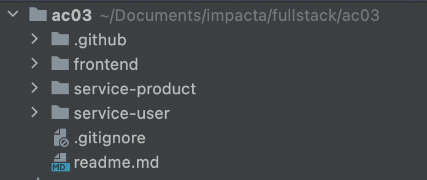
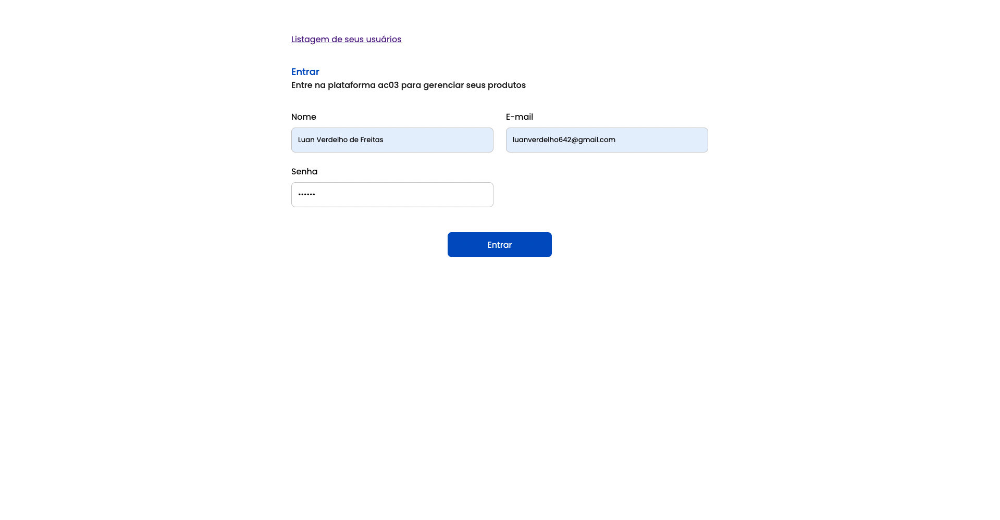
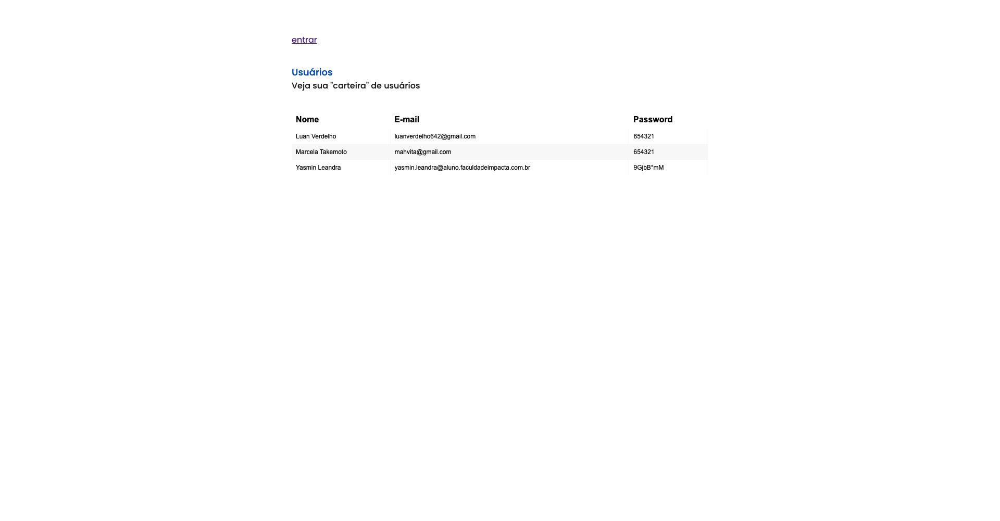
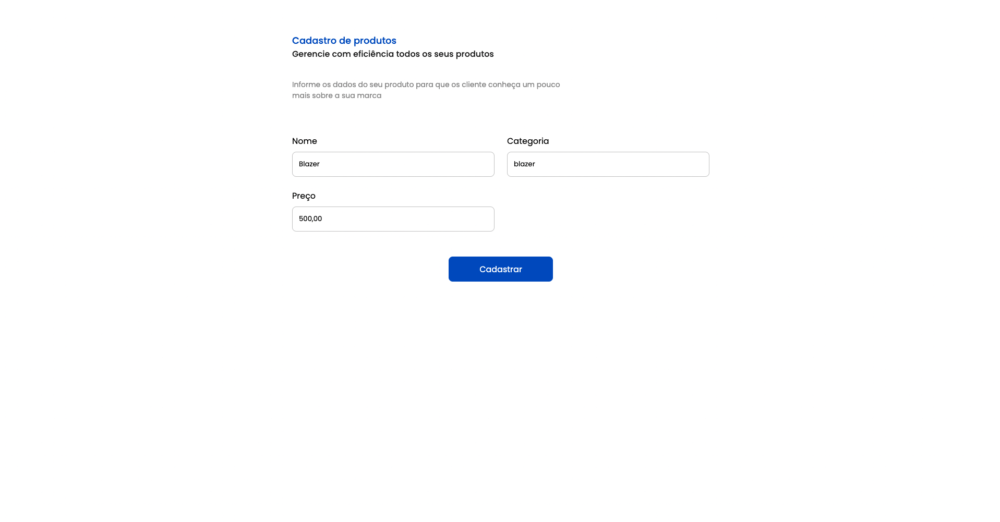
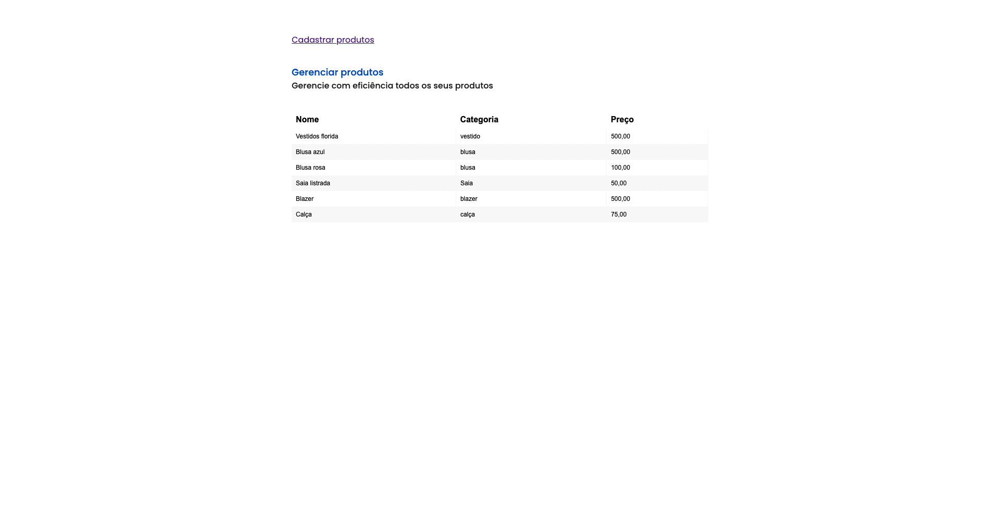

# Atividade continua 03

Projeto de microserviço utilizando docker, flask e mysql

## Participantes
1. Luan Verdelho de Freitas | RA: 1905364
2. Yasmin Leandra Pereira da Silva | RA: 1904614

## Projeto
O projeto foi inteiramente separado para ser trabalhado com microserviço. Ao olhar a arquitetura desse repositório você poderá notar que está separa em pastas

- .github: Usado unicamente para guardar as imagens do readme.md
- frontend: Projeto front-end utilizando HTML, CSS puro e juntamente com JQuery para fazer a comunicação com as APIs
- service-product: Serviço separado para o módulo de produto: cadastro e listagem
- service-users: Serviço separado para o módulo de usuário: cadastro e listagem

## Como executar
Entre no service-user e rode `docker-compose up -d ` e depois a mesma coisa no service-product 

Posteriormente, rode os seguintes comandos no banco de dados:

`CREATE DATABASE ac03;`

`USE ac03;`

`CREATE TABLE tb_users(
	id int primary key auto_increment,
    name varchar(100),
    email varchar(255),
    password varchar(255)
);`

`CREATE TABLE tb_products(
	id int primary key auto_increment,
    name varchar(100),
    category varchar(255),
    price varchar(255)
);`

## Telas

